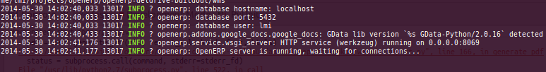
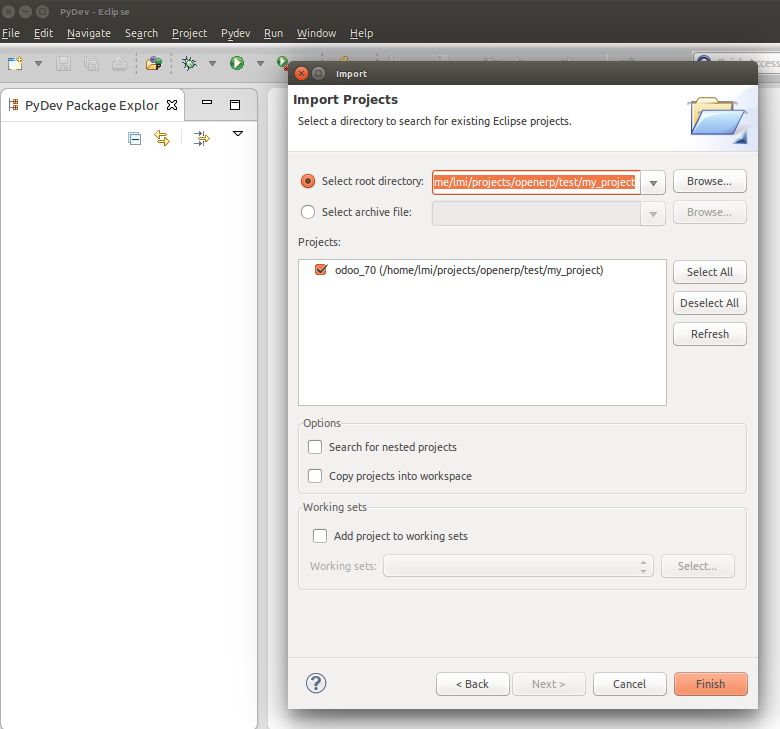
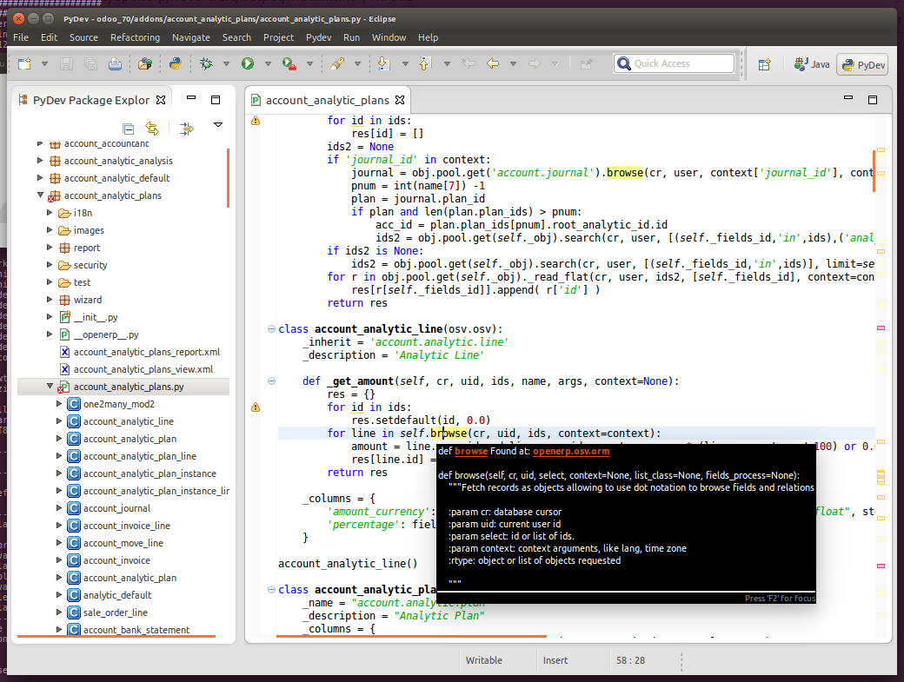
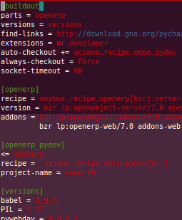
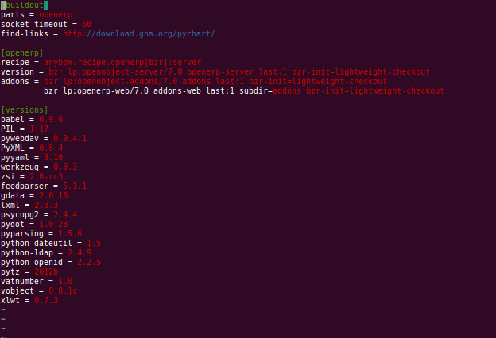
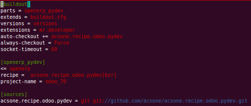

:title: acsone.recipe.odoo.pydev
:data-transition-duration: 1500
:css: odoo_recipe.css

----

Buildout / PyDev
================

Your development environment in 5 minutes!
------------------------------------------

----

5 Hours:
========

.. note::

    Average time to configure an *Odoo* environment

----

:data-y: r1000

* Install python extra packages

* get Odoo

* get exta addons

* configure Odoo

* start Odoo server

----

:data-rotate: 90

*Doesn't work ...*

----

* fixes addons-path

* try to start Odoo server again

* doesn't work

* install extra python dependecy for addons

* doesn't work dependency version mismatch...

* …

----

:data-x: r0
:data-y: r500
:data-scale: 0.1

* YES!! the server start! It's time to configure my dev env...*

----

:data-x: r-800
:data-scale: 1

5 minutes
=========

.. note::

    Average time to configure an *Odoo* using buildout

----

:id: console_1

.. code:: console

    $ virtualenv .
    $ ./bin/pip install zc.buildout
    Get the buildout.cfg
    $ ./bin/buildout
    $ ./bin/start_openerp

----

:data-rotate: 180
:data-y: r1000

----

----

.. image:: images/hourra.png

----

:data-y: r1000

What is buildout
================

* Python-based configuration-driven build tool

* Tool for working with eggs

* Repeatable

* Developer oriented

----

:data-rotate: 90

----

:id: anybox

anybox.recipe.openerp
=====================

A fully featured recipe developed by Anybox for Odoo
----------------------------------------------------

* quickly create an OpenERP instance in a predictable and repeatable way

* use any OpenERP version and any addons from any repositories (bzr, svn, hg, git)

* manage you OpenERP configuration from your buildout

* ...

----

:id: anybox_2
:data-y: r1100

----

:data-rotate: 90

acsone.recipe.odoo.pydev
========================

An extension to anybox.recipe.openerp
-------------------------------------

Generates a ready-to-use Eclipse PyDev Project, 
pointing to all dependencies required to develop, run
and debug your `Odoo <https://www.odoo.com>`_ server 
as well as your own addons.

----

:data-x: r0
:data-y: r1100

----

:id: ThreeD
:data-y: r1200
:data-rotate-x: 180

Available functionalities
=========================

* Code completion (with auto import)

* Go to definition

* Code analysis (pep 8)

* Refactoring

* Debugger

* Interactive console

* Find references

* ...

----

:id: thequestion
:data-scale: 2
:data-x: r0
:data-y: r1700

----

:data-rotate-y: 180
:data-scale: 3
:data-x: r-2500
:data-y: r0

Thanh you!!
===========

`anybox.recipe.openerp <http://pythonhosted.org/anybox.recipe.openerp>`_ http://pythonhosted.org/anybox.recipe.openerp

`acsone.recipe.odoo.pydev <https://github.com/acsone/acsone.recipe.odoo.pydev>`_ https://github.com/acsone/acsone.recipe.odoo.pydev

.. note::

    TADA!
